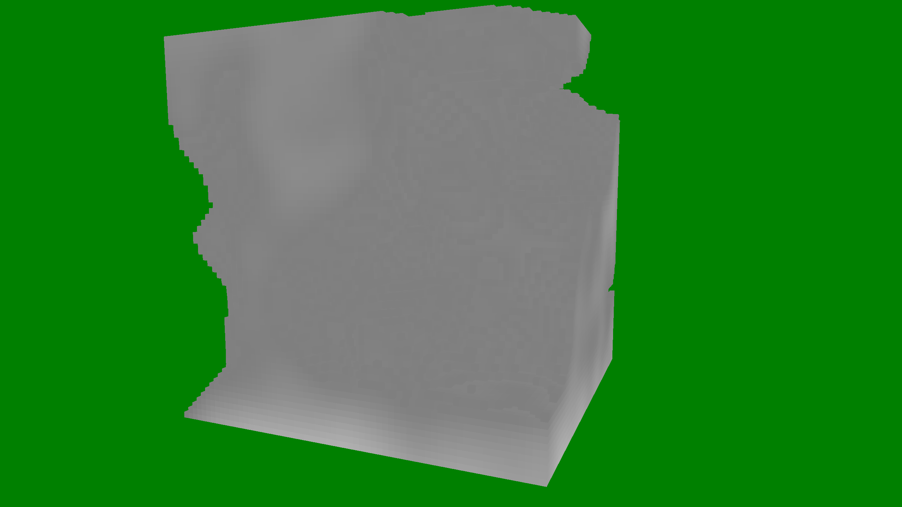

# Voxelizer

This is an attempt to create a Voxel Renderer from scratch using C++ and OpenGL. I will limit the use of external
dependencies besides some very common (i.e., [spdlog](https://github.com/gabime/spdlog), [fmt](https://github.com/fmtlib/fmt))
or very convenient (i.e., [GLFW](https://github.com/glfw/glfw), [GLM](https://github.com/g-truc/glm)) ones.

## Full List of Dependencies

- [fmt](https://github.com/fmtlib/fmt)
- [Glad2-CMake](https://github.com/FelixHommel/Glad2-CMake) (CMake compatible [Glad2](https://github.com/Dav1dde/glad) port, made by myself)
- [GLFW](https://github.com/glfw/glfw)
- [GLM](https://github.com/g-truc/glm)
- [GTest](https://github.com/google/googletest)
- [spdlog](https://github.com/gabime/spdlog)
- [stb](https://github.com/nothings/stb)
- [PerlinNoise](https://github.com/Reputeless/PerlinNoise)

## Acknowledgments / Credits

- [LearnOpenGL.com](https://learnopengl.com/)
